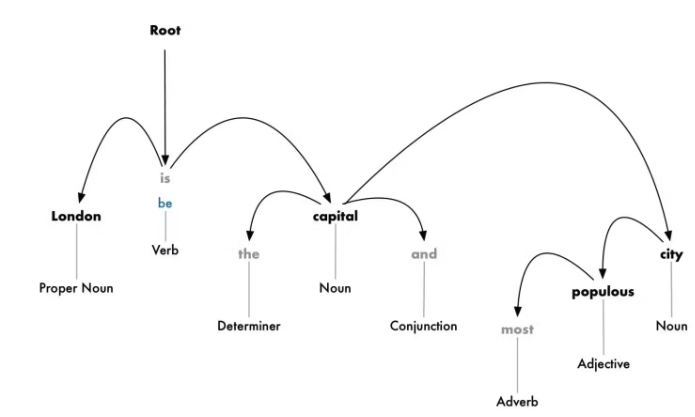
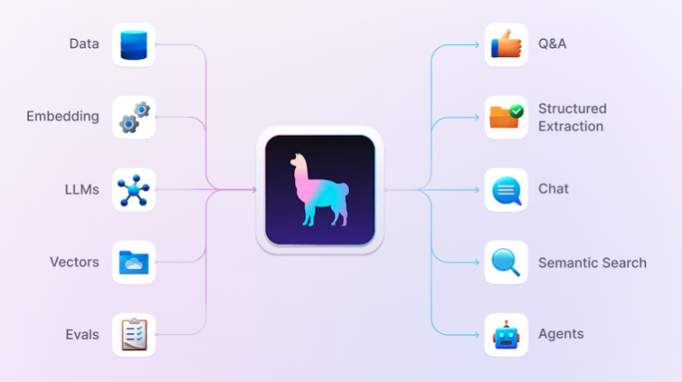
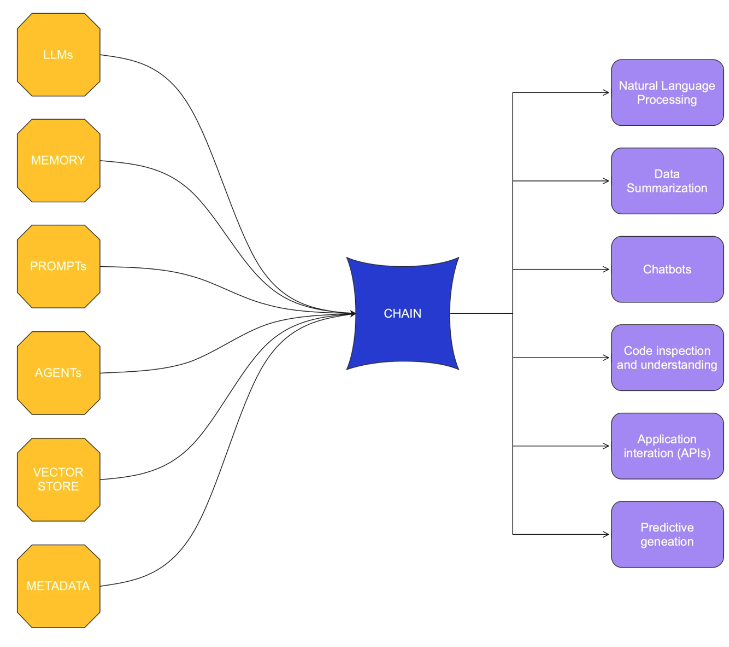
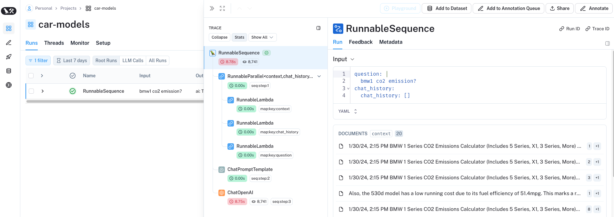
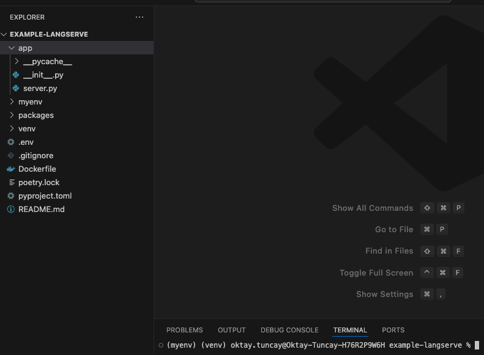
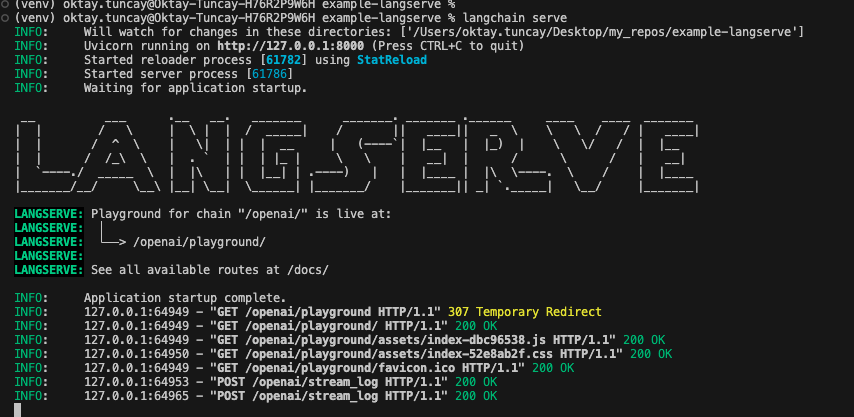
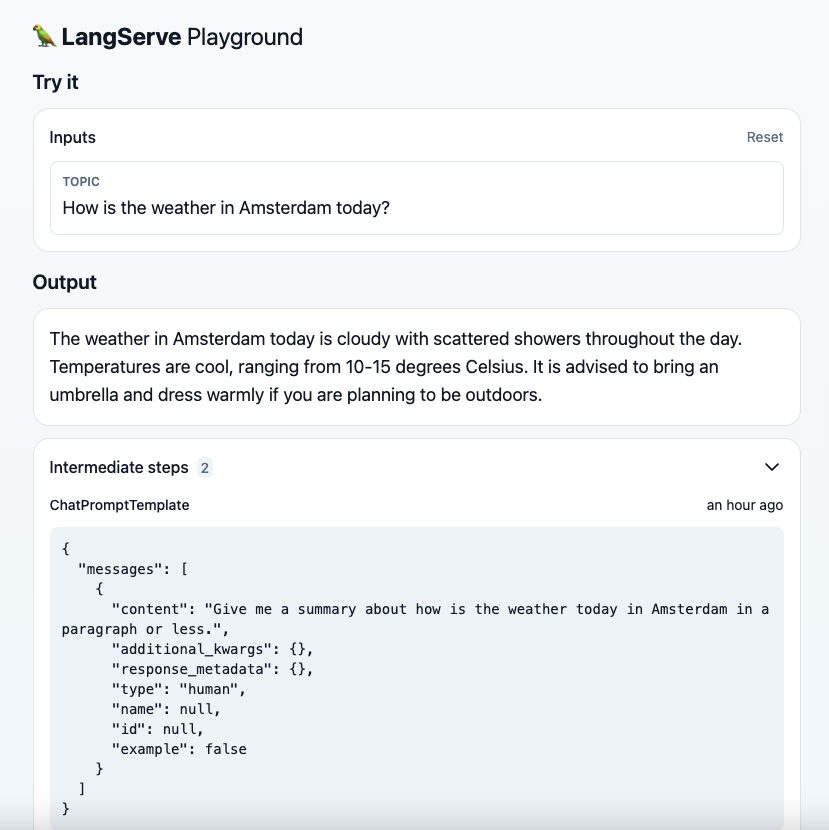

## Data API

### What is a Data API?

A Data API (Application Programming Interface) allows two software programs to communicate with each other. An API takes requests, fetches data, or performs actions, and then returns the response back to you.

**Endpoints:** Each API has different endpoints, which are specific addresses where certain data or functions can be accessed. For example, if there's an API for a book store, there might be an endpoint like /books to get a list of books.

The Data API allows you to <a href="https://docs.datastax.com/en/astra/astra-db-vector/api-reference/dataapiclient.html" target="_blank">programmatically interact</a> with Astra DB Serverless databases, handling operations on databases, collections, and documents. It supports a client-centric approach where you begin with a DataAPIClient to execute various database operations. 

This API utilizes JSON for requests and responses and provides detailed method examples across multiple programming languages such as Python, TypeScript, and Java.

To interact with the API, you need an Astra account, a Serverless database, and an application token with administrative privileges. The API offers comprehensive documentation with examples for various operations, including database and document management, and administrative tasks.

For a detailed exploration of the Data API, you can view the <a href="https://docs.datastax.com/en/astra/astra-db-vector/api-reference/overview.html" target="_blank">official documentation</a>.

## Language Processing

Natural language processing is used when we want machines to interpret human language. The main goal is to make meaning out of text in order to perform certain tasks automatically such as spell check, translation, for social media monitoring tools, and so on.

### Key Concepts in Language Processing

1. **Sentence Segmentation:** Divides the entire paragraph into different sentences for better understanding,

2. **Word Tokenization:** Breaks the sentence into separate words or tokens. This helps understand the context of the text.

3. **Stemming:** Stemming helps in preprocessing text. The model analyzes the parts of speech to figure out what exactly the sentence is talking about. Helps to predict the parts of speech for each token. For example, intelligently, intelligence, and intelligent. These words originate from a single root word ‘intelligen’. However, in English there’s no such word as ‘intelligen’.

4. **Lemmatization:** Removes inflectional endings and returns the canonical form of a word(lemma). It is similar to stemming except that the lemma is an actual word. For example, ‘playing’ and ‘plays’ are forms of the word ‘play’. Hence, play is the lemma of these words. Unlike a stem (recall ‘intelligen’), ‘play’ is a proper word.

5. **Stop Word Analysis:** Removing common words that may not be significant for analysis, such as "and", "the", etc. So, they are filtered out so as to focus on more important words.

6. **Dependency Parsing:** Mainly used to find out how all the words in a sentence are related to each other. To find the dependency, we can build a tree and assign a single word as a parent word. 

<p align="left">
  
</p>


7. **Part-of-Speech Tagging:** Tags contain verbs, adverbs, nouns, and adjectives that help indicate the meaning of words in a grammatically correct way in a sentence.

### Practical Applications

**Chatbots and Virtual Assistants:** These applications use language processing to understand user queries and provide relevant answers.

**Content Recommendations:** Language processing helps in analyzing user preferences through their interactions and providing content recommendations accordingly.

## Llama Index

<p align="left">
  
</p>

LlamaIndex, formerly known as GPT Index, is an orchestration or data framework that simplifies the integration of private data with public data for building applications using Large Language Models (LLMs).

LlamaIndex provides integration of data by fetching data from multiple unique sources, and embedding that data as vectors, and storing this new vectorized data in a vector database, allowing this data to be used by applications to perform complex operations with low-latency response times, such as vector search.

LlamaIndex simplifies data ingestion by connecting existing data sources such as APIs, PDFs, SQL, NoSQL, and documents for use with LLM applications.

### Why we need LlamaIndex?

The challenge with building LLM-based applications is that they need data, typically from multiple sources and formats such as structured, semistructured, and unstructured.

That is where LlamaIndex provides the toolbox to unlock this data with data ingestion and indexing. Once ingested and indexed, retrieval augmented generation (RAG) applications can use the LlamaIndex query interface for accessing that data and powering LLMs.

### Ingestion

LlamaIndex has 100s of data loaders that provide the ability to connect custom data sources to LLMs.

A complete list of data loaders can be found on the <a href="https://llamahub.ai/" target="_blank"> Llama Hub</a>..

### Indexing and Querying

Once data is ingested, that data needs to be mathematically represented so that it can be easily queried by an LLM. With LlamaIndex, an index simply provides the ability to represent data mathematically in multiple different dimensions.

The most common approach to indexing data for machine learning and LLMs is called a vector index and once data has been indexed the mathematical representation of the data is called a vector embedding.

There are many types of indexing and embedding models. Once data is embedded, a mathematical representation of data can be used to provide semantic search, as things like text with similar meanings will have a similar mathematical representation.

For example, king and queen might be highly related if the query is royalty but not highly related if the query is gender.

LlamaIndex offers several different indexing models that are designed to provide optimizations around how you want to explore and categorize your data. 

If you know the type of operation your application needs to perform on the data, leveraging a particular index type can provide significant benefits to the application that uses the LLM and initiates the query.


| Index Type          | Structure                            | Optimal Use Cases                                                                                          | Strengths                                                              |
|---------------------|--------------------------------------|------------------------------------------------------------------------------------------------------------|------------------------------------------------------------------------|
| **List Index**      | Sequential list                      | Structured objects over time, like change logs                                                             | Optimized for querying sequential data; good for tracking changes over time |
| **Tree Index**      | Binary tree (parent and leaf nodes)  | Natural language processing, support/FAQ systems                                                           | Efficient in traversing and extracting specific segments of data      |
| **Vector Store Index** | Vector embeddings                  | Smaller datasets locally or large datasets across multiple applications; similarity searches               | Flexible use of data through vector representation; supports multiple LLMs/applications |
| **Keyword Index**   | Metadata tag mapping                 | Large volumes of tagged data like legal briefings, medical records                                          | Allows complex queries based on keywords; useful for datasets with extensive metadata |

## Langchain

<p align="left">
  
</p>

LangChain is a library for building language model applications that interact with external APIs, databases, and more. 

Available in both Python and Javascript-based libraries, LangChain’s tools and APIs simplify the process of building LLM-driven applications like chatbots and virtual agents. 

LangChain’s module-based approach allows developers and data scientists to dynamically compare different prompts and even different foundation models with minimal need to rewrite code. This modular environment also allows for programs that use multiple LLMs: for example, an application that uses one LLM to interpret user queries and another LLM to author a response.

### Chains

As its name implies, chains are the core of LangChain’s workflows. They combine LLMs with other components, creating applications by executing a sequence of functions. 

The most basic chain is LLMChain. It simply calls a model and prompt template for that model. 

**For example**, imagine you saved a prompt as *ExamplePrompt* and wanted to run it against Flan-T5. You can import LLMChain from langchain.chains, then define chain_example as below;

```python
from langchain.chains import LLMChain

chain_example = LLMChain(llm = flan-t5, prompt = ExamplePrompt)
```

To run the chain for a given input, you simply call chain_example.run(“input”).

To use the output of one function as the input for the next function, you can use SimpleSequentialChain. Each function could utilize different prompts, different tools, different parameters or even different models, depending on your specific needs. 

LangChain is a framework that helps someone build an AI Application and simplify all the requirements without having to code all the little details. 

LangChain provides pre-built libraries for popular LLMs (like GPT-4 or GPT-3.5) so all a programmer has to do is provide their credentials and the prompt and wait for a response. 

## Langsmith (Monitor)

LangSmith provides tools to monitor, evaluate and debug applications, including the ability to automatically trace all model calls to spot errors and test performance under different model configurations. This visibility aims to empower more robust, cost-efficient applications.

Can be used with Python and TypeScript, For more information, please refer to the  LangSmith <a href="https://python.langchain.com/docs/langsmith/" target="_blank">documentation</a>.

### To Enable Monitoring Capabilities

```python
pip3 install -U langsmith
```

#### Create an API Key

To create an API key head to the settings <a href="https://smith.langchain.com/o/7f206571-8ff7-5ef1-ad8b-288d7de9b768/settings" target="_blank">page</a> on smith.langchain.com. Then click Create API Key.


#### Update the application

You can enable monitoring by adding the following lines to the application.

```python
os.environ['LANGCHAIN_TRACING_V2'] = 'True'
os.environ['LANGCHAIN_API_KEY'] = 'XXX'
os.environ['LANGCHAIN_ENDPOINT'] = 'https://api.smith.langchain.com'
os.environ['LANGCHAIN_PROJECT'] = 'car-models'
```

When you log in to Langsmith, you should see an output similar to the screenshot below.

<p align="left">
  
</p>

In this way; you can monitor and evaluate your language model applications and  agents to help you move from prototype to production.

## LangServe (Deployment)

LangServe is a library within the LangChain framework, designed to help developers deploy LangChain applications as REST APIs using FastAPI. 

It automatically extracts and applies input and output schemas for API calls, provides detailed error messages, supports concurrent requests, and has efficient API endpoints for single and batch calls. 

The library also includes a playground page for testing and API documentation capabilities. LangServe is built on well-established Python libraries like FastAPI and Pydantic, and it offers optional tracing to LangSmith with an API key.

**Note:** FastAPI is a fast (high-performance), web framework for building APIs with Python based on standard Python type hints.

### To Create REST APIs for LangChain Applications

LangChain is a powerful framework for building applications with AI language models. It simplifies the process of interfacing with local or remote LLMs by making it easy to template prompts, configure query contexts, and chain discrete processes together to form complex pipelines.

LangServe is a LangChain project that helps you build and deliver these applications over a REST API. Under the hood, it uses FastAPI to construct routes and build web services and leverages Pydantic to handle data validation.

**Note:** Pydantic is the most widely used data validation library for Python.

1. Create a project directory that will hold the application and assets you will create.

```bash
mkdir my-langserve-app
cd my-langserve-app
```

2. Inside the created directory, create a file named .env in your text editor. Define the OPENAI_API_KEY environment variable by setting it to your OpenAI API key.

```python
# .env
OPENAI_API_KEY="<YOUR_OPENAI_API_KEY>"
```
The application will read the API key in this file to verify its requests for OpenAI services.

3. Create a Virtual Environment

Some environments can be managed externally by a system package manager, such as Homebrew in macOS.

This means that your system may prevent you from installing packages globally to avoid conflicts with packages managed by the system package manager. This may pose an obstacle to package installation.

To avoid this issue, you can create a virtual environment before running python or pip commands.

```python
python3.11 -m venv myenv
source myenv/bin/activate
```

4. Create the app directory structure and install dependencies

Now that we are working in a virtual environment, we can start installing the packages that our application will use and setting up the project directory.

Standard Python installations include the pip package manager by default. However, the LangServe project uses poetry by default. Therefore, we will install our dependencies in two stages.

**Note:** Poetry is a tool for dependency management and packaging in Python. It allows you to declare the libraries your project depends on and it will manage (install/update) them for you. Poetry offers a lockfile to ensure repeatable installs, and can build your project for distribution.

First, install the langchain-cli and poetry package to get access to the langchain command line tool.

```python
pip install -U pip langchain-cli poetry
```

Next, with the newly installed langchain command, initialize a LangChain project in the current directory. The reason we added the dot is because the current directory is being targeted.

```python
langchain app new .
```

After running it, it will ask if you want to install any packages.
This prompt actually refers to LangChain templates, not Python packages. Press ENTER to continue without adding any templates.

With the new project files, your directory should look similar to the screenshot below:

<p align="left">
  
</p>

The **pyproject.toml** file is the primary file that the **langchain** command and **poetry** both use to record dependency information and configure project metadata.

```python
poetry add "langserve[all]" langchain-openai python-decouple
```

- **langserve[all]:** The server and client components of the LangServe library.
- **langchain-openai:** The package containing OpenAI integration for LangChain.
- **python-decouple:** A package that can be used to read environment variables and .env files.

### Create the LangServe application

To create a basic LangServe application, open the app/server.py file in the text editor and replace the existing contents with the following code:

```python
# app/server.py
from decouple import config
from fastapi import FastAPI
from langchain_openai import ChatOpenAI
from langchain.prompts import ChatPromptTemplate
from langserve import add_routes


app = FastAPI()

model = ChatOpenAI(openai_api_key=config("OPENAI_API_KEY"))
prompt = ChatPromptTemplate.from_template("Give me a summary about {topic} in a paragraph or less.")
chain = prompt | model

add_routes(app, chain, path="/openai")

if __name__ == "__main__":
    import uvicorn

    uvicorn.run(app, host="0.0.0.0", port=8000)
```

#### Working principle of the application

- Importing all of the necessary classes, functions, and other materials from the packages we've installed. 
- Initializes a FastAPI() instance that will serve as the primary application object for the application.
- Initialize instances of the ChatOpenAI and ChatPromptTemplate classes and assign them to the model and prompt variables.
  - For the ChatOpenAI instance, we pass in the OpenAI API key from our .env file using the config object from python-decouple.
  -  For the ChatPromptTemplate, we set the prompt to ask for a summary of the given topic.
  - Then chain these two together in a chain variable.
- Add a route to serve the new chain at /openai.
- Use uvicorn to serve the application on all interfaces using port 8000.

### Test the application

```python
langchain serve
```

<p align="left">
  
</p>

This will start the application server. To view the prompt page, navigate to http://127.0.0.1:8000/openai/playground/ in your web browser. 

You can test whether it works correctly by asking a question or topic.

<p align="left">
  
</p>

<a href="https://www.koyeb.com/tutorials/using-langserve-to-build-rest-apis-for-langchain-applications" target="_blank">Reference page of this section...</a>

#### Why Integrating OpenAI's models into a custom application using FastAPI?

Integrating OpenAI's models into a custom application using FastAPI, as in the example above, instead of directly using the ChatGPT web interface, offers several advantages, especially when it comes to customization, integration, and control.

1. **Custom Workflows and Logic:** By deploying your own application, you can integrate custom business logic that aligns with your specific requirements. For example, you can preprocess input data before sending it to the model, or postprocess the model's outputs for specific formatting or compliance needs.

2. **Integration with Internal Systems:** A custom application allows for easier integration with existing internal systems and databases. This can be crucial for applications that need to fetch or store data from company-specific databases or other internal services and APIs.

3. **Control Over Data:** When using your own application, you have full control over where and how your data is handled and stored. This can be important for privacy, security, and compliance with regulations like GDPR.

4. **Cost Management:** You can implement logic to control how often and under what conditions queries are sent to OpenAI's models. This can help manage costs by avoiding unnecessary API calls, especially if you can handle some requests locally or cache frequent queries.

5. **User Experience Customization:** You can design a user interface that specifically caters to your users' needs, which can be particularly important for applications requiring more complex interactions than a simple chat interface.

6. **Access to Multiple Models:** With your own setup, you can seamlessly integrate multiple models or switch between different models depending on the task, without being tied to a specific model or interface provided by OpenAI.

7. **Advanced Security Features:** You can implement advanced security measures such as authentication, encryption, and audit logs to ensure that access to the chat functionalities and underlying data is secure and compliant with your organizational standards.

## LangFlow


## RagStack


## NoSQLBench